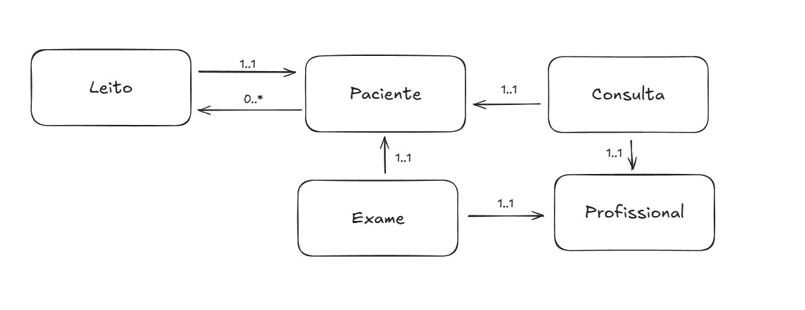

# Sistema Hospitalar - API REST

Sistema completo de gerenciamento hospitalar desenvolvido em Spring Boot com funcionalidades de CRUD para pacientes, profissionais de saúde, consultas, exames e leitos.

## 🏥 Funcionalidades

### 1. Cadastro e Atendimento de Pacientes

- ✅ Cadastro completo de pacientes
- ✅ Visualização de histórico clínico
- ✅ Agendamento e cancelamento de consultas
- ✅ Recebimento de notificações
- ✅ Acesso a teleconsulta

### 2. Gestão de Profissionais de Saúde

- ✅ Cadastro de médicos, enfermeiros, técnicos
- ✅ Gerenciamento de agendas
- ✅ Atualização de prontuários
- ✅ Emissão de receitas digitais
- ✅ Acompanhamento de histórico dos pacientes

### 3. Administração Hospitalar

- ✅ Controle de leitos
- ✅ Relatórios financeiros
- ✅ Gestão de suprimentos
- ✅ Dashboard com estatísticas

## 🚀 Como Executar

### Pré-requisitos

- Java 17 ou superior
- Gradle 7.0 ou superior

### Executando o Projeto

1. **Clone o repositório**

```bash
git clone <url-do-repositorio>
cd sistema-hospitalar
```

2. **Execute o projeto**

```bash
./gradlew bootRun
```

3. **Acesse a aplicação**

- API REST: http://localhost:8080
- **Swagger UI**: http://localhost:8080/swagger-ui.html
- **OpenAPI JSON**: http://localhost:8080/api-docs
- H2 Console: http://localhost:8080/h2-console
  - JDBC URL: `jdbc:h2:mem:testdb`
  - Username: `sa`
  - Password: `password`

## 📚 Documentação da API

### 🎯 **Swagger UI**

Acesse a documentação interativa da API em: **http://localhost:8080/swagger-ui.html**

A documentação inclui:

- ✅ Todos os endpoints organizados por tags
- ✅ Esquemas dos modelos de dados
- ✅ Exemplos de requisições e respostas
- ✅ Códigos de status HTTP
- ✅ Teste direto dos endpoints

### 📋 **Endpoints da API**

### Pacientes

```
GET    /api/pacientes                    - Listar todos os pacientes
GET    /api/pacientes/{id}               - Buscar paciente por ID
GET    /api/pacientes/cpf/{cpf}          - Buscar paciente por CPF
GET    /api/pacientes/nome/{nome}        - Buscar pacientes por nome
POST   /api/pacientes                    - Criar novo paciente
PUT    /api/pacientes/{id}               - Atualizar paciente
DELETE /api/pacientes/{id}               - Deletar paciente
GET    /api/pacientes/contar             - Contar pacientes ativos
GET    /api/pacientes/existe-cpf/{cpf}   - Verificar se CPF existe
```

### Profissionais de Saúde

```
GET    /api/profissionais                    - Listar todos os profissionais
GET    /api/profissionais/{id}               - Buscar profissional por ID
GET    /api/profissionais/cpf/{cpf}          - Buscar profissional por CPF
GET    /api/profissionais/registro/{registro} - Buscar profissional por registro
GET    /api/profissionais/nome/{nome}        - Buscar profissionais por nome
GET    /api/profissionais/tipo/{tipo}        - Buscar profissionais por tipo
GET    /api/profissionais/especialidade/{esp} - Buscar profissionais por especialidade
POST   /api/profissionais                    - Criar novo profissional
PUT    /api/profissionais/{id}               - Atualizar profissional
DELETE /api/profissionais/{id}               - Deletar profissional
GET    /api/profissionais/contar             - Contar profissionais ativos
GET    /api/profissionais/contar-tipo/{tipo} - Contar profissionais por tipo
```

### Consultas

```
GET    /api/consultas                           - Listar todas as consultas
GET    /api/consultas/{id}                      - Buscar consulta por ID
GET    /api/consultas/paciente/{pacienteId}     - Buscar consultas por paciente
GET    /api/consultas/profissional/{profId}     - Buscar consultas por profissional
GET    /api/consultas/status/{status}           - Buscar consultas por status
GET    /api/consultas/tipo/{tipo}               - Buscar consultas por tipo
POST   /api/consultas                           - Criar nova consulta
PUT    /api/consultas/{id}                      - Atualizar consulta
DELETE /api/consultas/{id}                      - Deletar consulta
PUT    /api/consultas/{id}/confirmar            - Confirmar consulta
PUT    /api/consultas/{id}/cancelar             - Cancelar consulta
PUT    /api/consultas/{id}/iniciar              - Iniciar consulta
PUT    /api/consultas/{id}/finalizar            - Finalizar consulta
```

### Exames

```
GET    /api/exames                           - Listar todos os exames
GET    /api/exames/{id}                      - Buscar exame por ID
GET    /api/exames/paciente/{pacienteId}     - Buscar exames por paciente
GET    /api/exames/profissional/{profId}     - Buscar exames por profissional
GET    /api/exames/status/{status}           - Buscar exames por status
GET    /api/exames/tipo/{tipoExame}          - Buscar exames por tipo
POST   /api/exames                           - Criar novo exame
PUT    /api/exames/{id}                      - Atualizar exame
DELETE /api/exames/{id}                      - Deletar exame
PUT    /api/exames/{id}/realizar             - Realizar exame
PUT    /api/exames/{id}/analisar             - Analisar exame
PUT    /api/exames/{id}/concluir             - Concluir exame
PUT    /api/exames/{id}/cancelar             - Cancelar exame
```

### Leitos

```
GET    /api/leitos                           - Listar todos os leitos
GET    /api/leitos/{id}                      - Buscar leito por ID
GET    /api/leitos/numero/{numeroLeito}      - Buscar leito por número
GET    /api/leitos/status/{status}           - Buscar leitos por status
GET    /api/leitos/setor/{setor}             - Buscar leitos por setor
GET    /api/leitos/tipo/{tipoLeito}          - Buscar leitos por tipo
GET    /api/leitos/disponiveis               - Buscar leitos disponíveis
GET    /api/leitos/disponiveis/setor/{setor} - Buscar leitos disponíveis por setor
POST   /api/leitos                           - Criar novo leito
PUT    /api/leitos/{id}                      - Atualizar leito
DELETE /api/leitos/{id}                      - Deletar leito
PUT    /api/leitos/{leitoId}/internar/{pacienteId} - Internar paciente
PUT    /api/leitos/{id}/alta                 - Dar alta ao paciente
PUT    /api/leitos/{id}/reservar             - Reservar leito
PUT    /api/leitos/{id}/liberar              - Liberar leito
PUT    /api/leitos/{id}/manutencao           - Colocar leito em manutenção
```

### Relatórios

```
GET    /api/relatorios/dashboard              - Dashboard geral
GET    /api/relatorios/pacientes/estatisticas - Estatísticas de pacientes
GET    /api/relatorios/profissionais/estatisticas - Estatísticas de profissionais
GET    /api/relatorios/leitos/estatisticas    - Estatísticas de leitos
GET    /api/relatorios/ocupacao-leitos        - Ocupação de leitos
```

## 🗄️ Estrutura do Banco de Dados

### Tabelas Principais

- **pacientes**: Cadastro de pacientes
- **profissionais_saude**: Cadastro de profissionais
- **consultas**: Agendamentos e atendimentos
- **exames**: Exames laboratoriais e de imagem
- **leitos**: Controle de leitos hospitalares



### Enums Utilizados

- **TipoProfissional**: MEDICO, ENFERMEIRO, TECNICO, FISIOTERAPEUTA, PSICOLOGO, NUTRICIONISTA
- **StatusConsulta**: AGENDADA, CONFIRMADA, EM_ANDAMENTO, CONCLUIDA, CANCELADA, NAO_COMPARECEU
- **TipoConsulta**: CONSULTA_PRESENCIAL, TELEMEDICINA, RETORNO, EMERGENCIA
- **StatusExame**: AGENDADO, REALIZADO, ANALISADO, CONCLUIDO, CANCELADO
- **StatusLeito**: DISPONIVEL, OCUPADO, EM_MANUTENCAO, RESERVADO

## 📋 Exemplos de Uso

### Criar um Paciente

```bash
curl -X POST http://localhost:8080/api/pacientes \
  -H "Content-Type: application/json" \
  -d '{
    "nome": "João Silva",
    "cpf": "123.456.789-00",
    "dataNascimento": "1990-01-01",
    "telefone": "(11) 99999-9999",
    "email": "joao@email.com",
    "endereco": "Rua das Flores, 123",
    "cidade": "São Paulo",
    "estado": "SP",
    "cep": "01234-567"
  }'
```

### Criar um Profissional

```bash
curl -X POST http://localhost:8080/api/profissionais \
  -H "Content-Type: application/json" \
  -d '{
    "nome": "Dr. Maria Santos",
    "cpf": "987.654.321-00",
    "dataNascimento": "1985-05-15",
    "telefone": "(11) 88888-8888",
    "email": "maria@hospital.com",
    "endereco": "Av. Paulista, 1000",
    "cidade": "São Paulo",
    "estado": "SP",
    "cep": "01310-100",
    "tipoProfissional": "MEDICO",
    "especialidade": "Cardiologia",
    "registroProfissional": "CRM-12345",
    "dataFormacao": "2010-12-15",
    "instituicaoFormacao": "USP"
  }'
```

### Agendar uma Consulta

```bash
curl -X POST http://localhost:8080/api/consultas \
  -H "Content-Type: application/json" \
  -d '{
    "paciente": {"id": 1},
    "profissional": {"id": 1},
    "dataHora": "2024-01-15T14:00:00",
    "dataHoraFim": "2024-01-15T15:00:00",
    "tipoConsulta": "CONSULTA_PRESENCIAL",
    "status": "AGENDADA",
    "observacoes": "Primeira consulta"
  }'
```

## 🛠️ Tecnologias Utilizadas

- **Spring Boot 3.5.3**: Framework principal
- **Spring Data JPA**: Persistência de dados
- **H2 Database**: Banco de dados em memória
- **SpringDoc OpenAPI**: Documentação da API (Swagger)
- **Lombok**: Redução de boilerplate
- **Gradle**: Build tool
- **Java 17**: Linguagem de programação

## 📊 Funcionalidades por Perfil

### Pacientes

- ✅ Cadastrar dados pessoais
- ✅ Visualizar histórico clínico
- ✅ Agendar/cancelar consultas
- ✅ Receber notificações
- ✅ Acessar teleconsulta

### Profissionais de Saúde

- ✅ Gerenciar agendas
- ✅ Atualizar prontuários
- ✅ Emitir receitas digitais
- ✅ Acompanhar histórico dos pacientes

### Administradores

- ✅ Gerenciar cadastros (pacientes, profissionais)
- ✅ Controlar fluxo de internações
- ✅ Gerar relatórios
- ✅ Monitorar ocupação de leitos

## 🔧 Configurações

O sistema está configurado para usar:

- **Porta**: 8080
- **Banco**: H2 (memória)
- **DDL**: create-drop (recria tabelas a cada execução)
- **Logs**: SQL e requisições habilitados
- **Swagger UI**: http://localhost:8080/swagger-ui.html
- **OpenAPI**: http://localhost:8080/api-docs

## 📝 Licença

Este projeto foi desenvolvido como trabalho final de curso.
